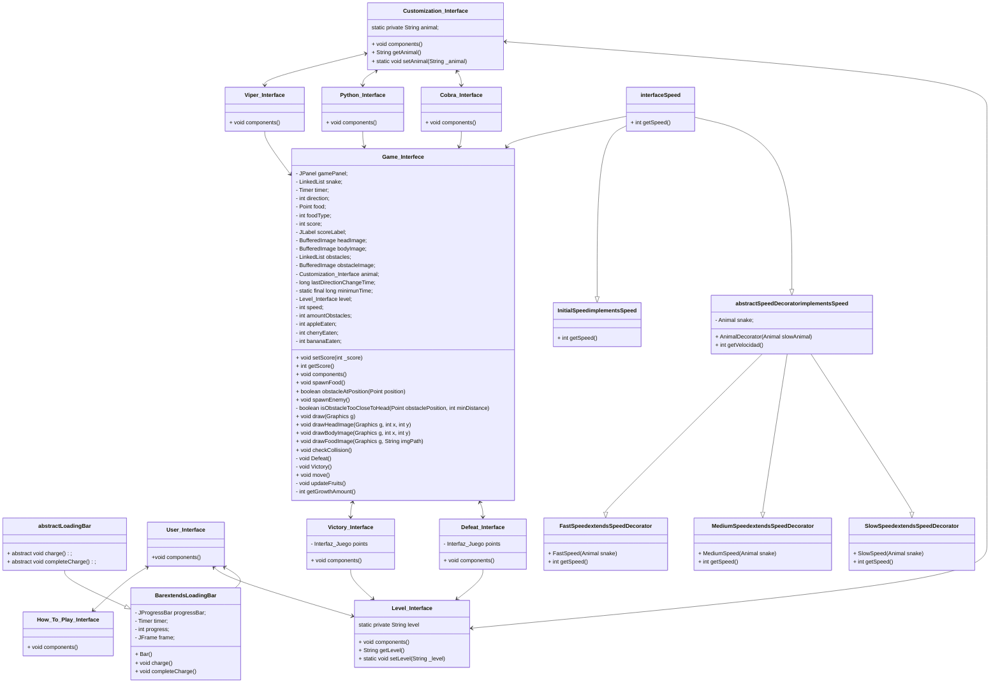

#  Snake Challenge
## Desarrolladores:
- Diego Hernández García-Panadero. 
- Álvaro Mingo Muñoz.

###  Descripción
El juego es una versión mejorada del juego Snake. Los jugadores manejarán una
serpiente hambrienta que come alimentos para crecer y acumular puntos.

La serpiente está en constante movimiento, se desplaza en busca de comida y cuanto
más coma, más crecerá.
En este juego se busca añadir diferentes tipos de alimentos, cada uno con un valor
distinto de puntos.
- **Manzana**. (1p)
- **Cereza**. (2p)
- **Plátano**. (3p)

En la pantalla de juego irán apareciendo enemigos, los cuales aumentarán su frecuencia
dependiendo del nivel de dificultad. Chocar con los enemigos finalizará el juego.
- **Enemigos**.

Los jugadores irán obteniendo puntos al comer los distintos alimentos, el objetivo es
conseguir la mayor cantidad de puntos hasta perder. Se podrá ver la puntuación actual
en la pantalla en tiempo real.

#### __Esquema UML__

#### Interfaz de usuario

En la interfaz de usuario aparecerán tres botones, el primero de "Play", donde se
pasará a los tres modos de dificultad, el segundo botón pertenece a "How to play", donde se
muestran las instrucciones de cómo jugar y el tercer boton es el botón de "Exit", para finalizar el juego.

**Barra de carga**

**Pantalla Inicial**

**Pantalla de Niveles**

En la interfaz de Niveles aparecerán tres botones, el primero botón corresponde con el nivel "Easy",el segundo botón con el nivel "Medium"
y el tercer botón con el nivel "Hard". Los tres botones tras presionar alguno de ellos, te llevarán a la interfaz de personalización.

**Pantalla de Personalización**

En la interfaz de Personalización aparecerán tres botones, el primero botón corresponde con la serpiente "Cobra",el segundo botón con la serpiente "Python"
y el tercer botón con la serpiente "Viper". Los tres botones tras presionar alguno de ellos, te llevarán a la interfaz de dicha serpiente mostrando una descripción
detallada de esta, además de tener dos botones, uno para empezar el juego y otro para volver atras para elegir otras serpientes.

**Pantalla de Cómo Jugar**

**Marcador y Tablero**

**Personalización de la serpiente**

**Cobra**

**Pitón.**

**Víbora**

**Derrota**

**Victoria**

**Cobra en el juego**

**Pitón en el juego**

**Víbora en el juego**

**Comida**

**Manzana**

**Cereza**

**Platano**

**Enemigo**

**Juego en accion**

