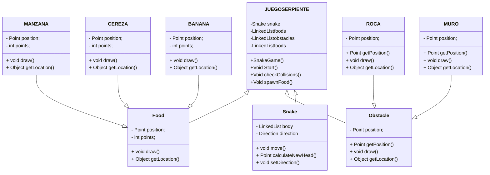

#  Snake Challenge
##  Autores: Diego Hernández García-Panadero y Álvaro Mingo Muñoz
========================================================

###  Descripción
El juego es una versión mejorada del juego Snake. Los jugadores manejarán una
serpiente hambrienta que come alimentos para crecer y acumular puntos.

La serpiente está en constante movimiento, se desplaza en busca de comida y cuanto
más coma, más crecerá.
En este juego se busca añadir diferentes tipos de alimentos, cada uno con un valor
distinto de puntos.
- **Manzana**. (1p)
- **Cereza**. (2p)
- **Plátano**. (3p)

En la pantalla de juego irán apareciendo obstáculos, los cuales aumentarán su frecuencia
dependiendo del nivel de dificultad.Chocar con alguno de estos obstaculos finalizará el juego.
- **Rocas**.
- **Muros**.

Los jugadores irán obteniendo puntos al comer los distintos alimentos, el objetivo es
conseguir la mayor cantidad de puntos hasta perder. Se podrá ver la puntuación actual
en la pantalla en tiempo real.

#### __Esquema UML__

##### Interfaz de usuario

**Pantalla inicial**

Inline-style: 

