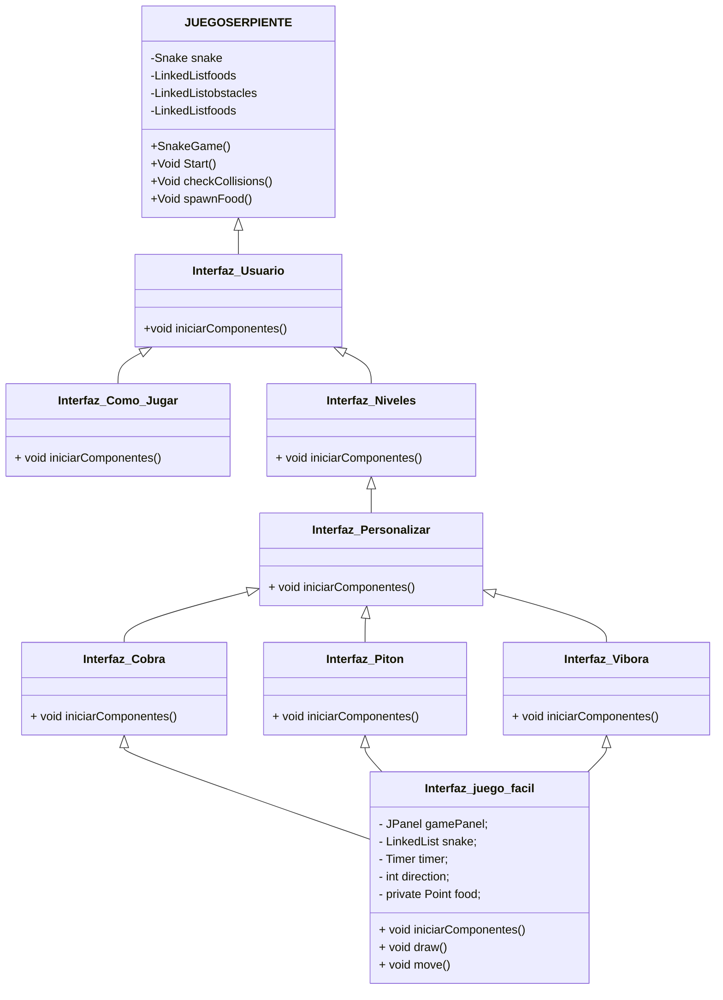

#  Snake Challenge
## Desarrolladores:
- Diego Hernández García-Panadero. 
- Álvaro Mingo Muñoz.

###  Descripción
El juego es una versión mejorada del juego Snake. Los jugadores manejarán una
serpiente hambrienta que come alimentos para crecer y acumular puntos.

La serpiente está en constante movimiento, se desplaza en busca de comida y cuanto
más coma, más crecerá.
En este juego se busca añadir diferentes tipos de alimentos, cada uno con un valor
distinto de puntos.
- **Manzana**. (1p)
- **Cereza**. (2p)
- **Plátano**. (3p)

En la pantalla de juego irán apareciendo obstáculos, los cuales aumentarán su frecuencia
dependiendo del nivel de dificultad. Chocar con alguno de estos obstáculos finalizará el juego.
- **Rocas**.
- **Muros**.

Los jugadores irán obteniendo puntos al comer los distintos alimentos, el objetivo es
conseguir la mayor cantidad de puntos hasta perder. Se podrá ver la puntuación actual
en la pantalla en tiempo real.

#### __Esquema UML__

#### Interfaz de usuario

En la interfaz de usuario aparecerán cuatro botones, el primero de jugar, donde se
pasará a los tres modos de dificultad, el segundo botón pertenece cómo jugar, donde se
muestran las instrucciones de cómo jugar, el tercer botón sirve para personalizar la skin
de la serpiente y el cuarto es el botón de salir, para finalizar el juego.

**Pantalla Inicial.**

**Pantalla de Niveles**

**Pantalla de Personalización**

**Pantalla de Cómo Jugar**

**Marcador y Tablero.**

**Personalización de la serpiente.**

**Cobra.**

**Pitón.**

**Víbora.**

